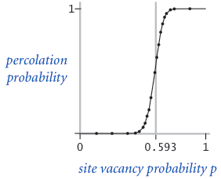
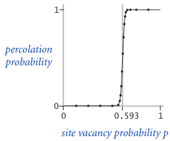
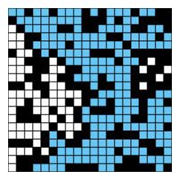

~ number: 2
~ title: Disjoint Sets and Percolation

	
	

Getting the Skeleton Files
--------------------------------

As usual, run `git pull skeleton master` to get the skeleton files.

Introduction
--------------------------------
In this program, we'll write a program to estimate the value of the percolation threshold via [Monte Carlo simulation](https://en.wikipedia.org/wiki/Monte_Carlo_method).

**Introductory Video.** An introductory video for this HW can be found at [this link](https://www.youtube.com/watch?v=kIYKCsvG6UI&list=PLNSdoiHk6ujjZs46s6XVXEbZUuF1MIO7g). It is broken into three parts: Intro, Implementation Spoilers, and Optimization Spoilers. Feel free to ignore these spoilers for a more difficult challenge. If you'd prefer to watch a two year old video I made when I was at Princeton, see [this link](https://www.youtube.com/watch?v=o60oHXesOuA).

**HW2 Slides.** Slides for this HW can be found [here](https://docs.google.com/presentation/d/1AV5v-gTSIi5xUwtm-FtkReUmuTA3Mqry1eGjje7OgQo/edit?usp=sharing). Because this is a HW and not a project, I give spoilers for how to approach the HW. You may ignore them if you'd like a bigger challenge.

**Percolation.** Given a composite systems comprised of randomly distributed insulating and metallic materials: what fraction of the materials need to be metallic so that the composite system is an electrical conductor? Given a porous landscape with water on the surface (or oil below), under what conditions will the water be able to drain through to the bottom (or the oil to gush through to the surface)? Scientists have defined an abstract process known as percolation to model such situations.

**The model.** We model a percolation system using an N-by-N grid of sites. Each site is either open or blocked. A full site is an open site that can be connected to an open site in the top row via a chain of neighboring (left, right, up, down) open sites. We say the system percolates if there is a full site in the bottom row. In other words, a system percolates if we fill all open sites connected to the top row and that process fills some open site on the bottom row. (For the insulating/metallic materials example, the open sites correspond to metallic materials, so that a system that percolates has a metallic path from top to bottom, with full sites conducting. For the porous substance example, the open sites correspond to empty space through which water might flow, so that a system that percolates lets water fill open sites, flowing from top to bottom.)

**The problem.** In a famous scientific problem, researchers are interested in the following question: if sites are independently set to be open with probability p (and therefore blocked with probability 1 − p), what is the probability that the system percolates? When p equals 0, the system does not percolate; when p equals 1, the system percolates. The plots below show the site vacancy probability p versus the percolation probability for 20-by-20 random grid (left) and 100-by-100 random grid (right).

     

When $N$ is sufficiently large, there is a threshold value $p^&#42;$ such that when $p < p^&#42;$ a random N-by-N grid almost never percolates, and when $p > p^&#42;$, a random N-by-N grid almost always percolates. No mathematical solution for determining the percolation threshold $p^&#42;$ has yet been derived. Your task is to write a computer program to estimate $p^&#42;$.

Percolation.java
--------------------------------

**Percolation data type.** To model a percolation system, create a data type in the hw2 package named `Percolation` with the following API:

    public class Percolation {
       public Percolation(int N)                // create N-by-N grid, with all sites initially blocked
       public void open(int row, int col)       // open the site (row, col) if it is not open already
       public boolean isOpen(int row, int col)  // is the site (row, col) open?
       public boolean isFull(int row, int col)  // is the site (row, col) full?
       public int numberOfOpenSites()           // number of open sites
       public boolean percolates()              // does the system percolate?
       public static void main(String[] args)   // unit testing (not required)
    }

**Corner cases.**  By convention, the row and column indices are integers between 0 and N − 1, where (0, 0) is the upper-left site: Throw a java.lang.IndexOutOfBoundsException if any argument to `open()`, `isOpen()`, or `isFull()` is outside its prescribed range. The constructor should throw a `java.lang.IllegalArgumentException` if N ≤ 0.

**Performance requirements.**  The constructor should take time proportional to $N^2$; all methods should take constant time plus a constant number of calls to the union-find methods `union()`, `find()`, `connected()`, and `count()`. Meeting these requirements is somewhat tricky! You might consider creating a solution that simply works, before figuring out a way to make it faster. For tips on meeting the speed requirements, see the video at the beginning of this spec. Your `numberOfOpenSites()` method must take constant time.

PercolationStats.java
--------------------------------

**Monte Carlo simulation.** To estimate the percolation threshold, consider the following computational experiment:

 - Initialize all sites to be blocked.
 - Repeat the following until the system percolates:
 - Choose a site uniformly at random among all blocked sites.
 - Open the site.
 - The fraction of sites that are opened when the system percolates provides an estimate of the percolation threshold.

For example, if sites are opened in a 20-by-20 grid according to the snapshots below, then our estimate of the percolation threshold is 204/400 = 0.51 because the system percolates when the 204th site is opened. The images correspond to the 50, 100, 150, and 204 sites being open, respectively.

                  

By repeating this computation experiment $T$ times and averaging the results, we obtain a more accurate estimate of the percolation threshold. Let $x\_t$ be the fraction of open sites in computational experiment $t$. The sample mean $\mu$ provides an estimate of the percolation threshold; the sample standard deviation $\sigma$ measures the sharpness of the threshold.

$\mu = \frac{x\_1 + x\_2 + ... + x\_T}{T}$, $\sigma^2 = \frac{(x\_1 - \mu)^2 + (x\_2 - \mu)^2 + ... + (x\_T - \mu)^2}{T-1}$

Assuming T is sufficiently large (say, at least 30), the following provides a 95% confidence interval for the percolation threshold:

$[\mu - \frac{1.96\sigma}{\sqrt{T}}, \mu + \frac{1.96\sigma}{\sqrt{T}}]$

To perform a series of computational experiments, create a data type in the hw2 package named `PercolationStats` with the following API:

    public class PercolationStats {
       public PercolationStats(int N, int T)   // perform T independent experiments on an N-by-N grid
       public double mean()                    // sample mean of percolation threshold
       public double stddev()                  // sample standard deviation of percolation threshold
       public double confidenceLow()           // low  endpoint of 95% confidence interval
       public double confidenceHigh()          // high endpoint of 95% confidence interval
    }

The constructor should throw a java.lang.IllegalArgumentException if either N ≤ 0 or T ≤ 0.

The constructor should take two arguments N and T, and perform T independent computational experiments (discussed above) on an N-by-N grid. Using this experimental data, it should calculate the mean, standard deviation, and the 95% confidence interval for the percolation threshold.

You must use [`edu.princeton.cs.introcs.StdRandom`](http://algs4.cs.princeton.edu/code/javadoc/edu/princeton/cs/algs4/StdRandom.html) to generate random numbers because our testing suite relies on this library. You should use [`edu.princeton.cs.introcs.StdStats`](http://algs4.cs.princeton.edu/code/javadoc/edu/princeton/cs/algs4/StdStats.html) to compute the sample mean and standard deviation, but if you'd prefer, you're welcome to write your own functions to compute statistics.

Runtime Analysis (Ungraded)
--------------------------------

This part of the HW will not be graded, but a similar problem will appear on midterm 2.

- Implement the Percolation data type using the quick-find algorithm in QuickFindUF. Use Stopwatch to measure the total running time of PercolationStats for various values of N and T. How does doubling N affect the total running time? How does doubling T affect the total running time? Give a formula (using tilde notation) of the total running time on your computer (in seconds) as a single function of both N and T.

- Now, implement the Percolation data type using the weighted quick-union algorithm in WeightedQuickUnionUF. Answer the same questions in the previous bullet.

Provided Files
--------------------------------

We provide two clients that serve as large-scale visual traces. We highly recommend using them for testing and debugging your Percolation implementation.

**Interactive Visualization client.** InteractivePercolationVisualizer.java animates the results of opening sites in a percolation system, using the mouse as input. It takes a command-line integer N that specifies the grid size. As a bonus, it prints out the sequence of sites opened in the same format used by `PercolationVisualizer` (described below), so you can use it to prepare interesting files for testing. If you design an interesting data file, feel free to share it in the discussion forums.

**File-Based Visualization client.** 

This test is similar to the first test client except that the input comes from a file (instead of mouse clicks). It visualizes by performing the following steps:

 - Read the grid size N from the file.
 - Create an N-by-N grid of sites (initially all blocked).
 - Read in a sequence of sites (row i, column j) to open from the file. After each site is opened, draw full sites in light blue, open sites (that aren't full) in white, and blocked sites in black using standard draw, with site (0, 0) in the upper left-hand corner.

The program should behave as in this movie and the following snapshots when used with input20.txt. The images correspond to the 50, 100, 150,  204, and 250 sites being open, respectively.

       $ cat input20.txt
       20
        6 10
       17 10
       11  4
        8  4
        4  8
        0  0
       ...

       $ java PercolationVisualizer input20.txt

                       

**Sample data files.** The `inputFiles` directory contains some sample files for use with the visualization client. Associated with most input `.txt` file is an output `.png` file that contains the desired graphical output at the end of the visualization.

Submission
--------------------------------

Submit a zip file containing `Percolation.java` (using the weighted quick-union algorithm from `WeightedQuickUnionUF`) and `PercolationStats.java`. You do not need to submit any other files.

FAQ
--------------------------------

#### What should stddev() return if T equals 1?
The sample standard deviation is undefined. We recommend returning Double.NaN but we will not test this case.

#### After the system has percolated, PercolationVisualizer colors in light blue all sites connected to open sites on the bottom (in addition to those connected to open sites on the top). Is this "backwash" acceptable? 

While allowing backwash does not strictly conform to the Percolation API, it requires quite a bit of ingenuity to fix and it leads to only a small deduction if you don't. 

#### How do I generate a site uniformly at random among all blocked sites for use in PercolationStats? 

Pick a site at random (by using StdRandom or some other library to generate two integers between 0 (inclusive) and N (exclusive) and use this site if it is blocked; if not, repeat.

#### I don't get reliable timing information in PercolationStats when N = 200. What should I do? 

Increase the size of N (say to 400, 800, and 1600), until the mean running time exceeds its standard deviation.

Credits
----------------
This assignment originally developed by Kevin Wayne and Bob Sedgewick at Princeton University, with autograder built by Josh Hug for the Princeton Algorithms course.