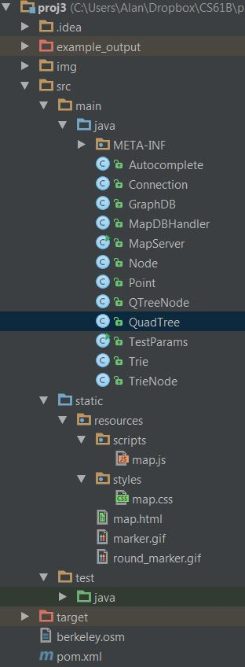
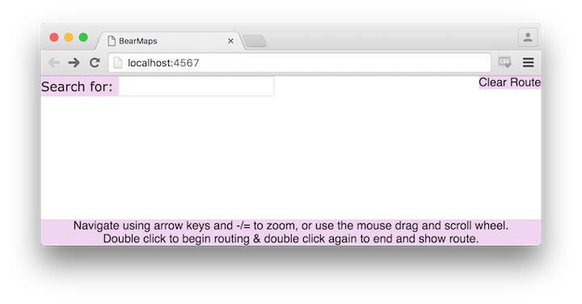
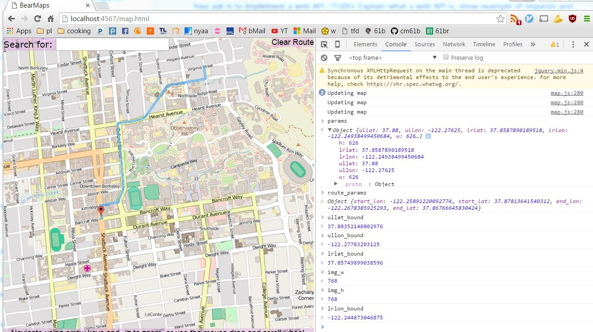
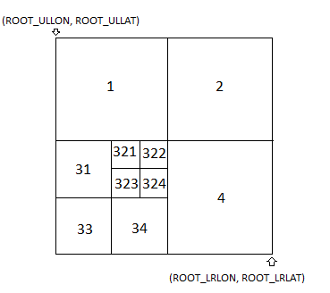
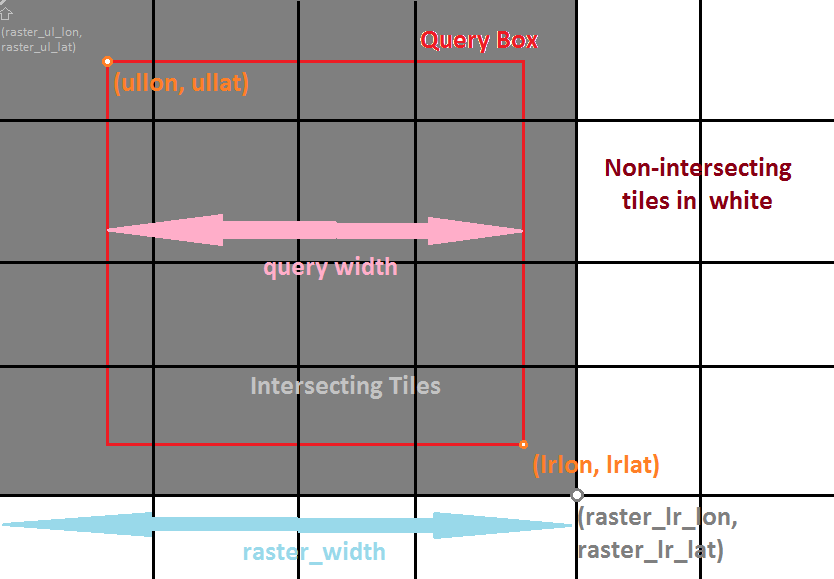
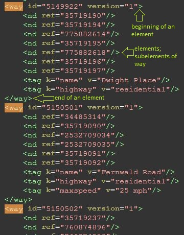
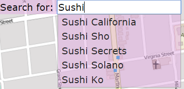
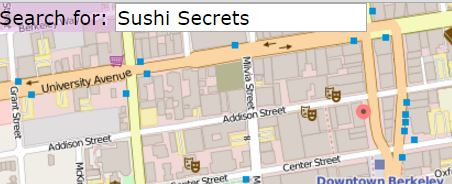

~ number: 3

~ title: Bear Maps, version 1.0

~ author: Alan Yao

Table of Contents
-------------------
* [Introduction](#introduction)
* [Overview](#overview)
* [Getting the Skeleton Files](#getting-the-skeleton-files)
* [Rastering](#map-rastering)
* [Routing](#routing)
* [Autocompletion and Search](#autocompletion-and-search)
* [Frequently Asked Questions](#frequently-asked-questions)
* [Acknowledgements](#acknowledgements)

Introduction
------------

Project 3 is a web mapping application, inspired by my time on the Google Maps team and the [OpenStreetMap](http://www.openstreetmap.org/) project, from which the tile images and map feature data was downloaded. You are working with real-world mapping data here that is freely available - after you've finished this project, you can even extend your code to support a wider range of features. You will be writing the back end - the web server that powers the API that the front end makes requests to.

By the end of this project, with some extra work, you can even host your application as a web app, like I've done [here](http://bearmaps.alanyao.com). It's hosted for free on Heroku. For better performance, shrink your window. You should expect extremely bad performance overall with six hours of downtime per day (there's 1000+ students and one free instance!). Your project cannot perform as poorly and should have sub-0.5s response times, especially since you are hosting locally.

####Meta Advice

*This spec is not meant to be complete.* Many design decisions are left to you, although with suggestions given. Many implementation details are not given; you are expected to read the entirety of the skeleton (which is well-commented or self-explanatory) and the javadoc to determine how to proceed. You will especially want to read all the constants defined.

However, the spec is written in a way so that you can proceed linearly down - that is, while each feature is partially dependent on the previous one, your design decisions, as long as they are generally reasonable, should not obstruct how you think about implement the following parts. You **are required to read the entire spec section before asking questions**. If your question is answered in the spec, we will only direct you to the spec.

 **Modularize**. Make sure to split your program into multiple logical parts. Here's what my setup looks like: 
 
I don't mind if you copy it or do something similar.

Getting the Skeleton Files
----------------

For this project we **very strongly** recommend using IntelliJ. If IntelliJ doesn't work on your computer (either because it won't open or it's very slow), please fill out [this form](http://goo.gl/forms/QmLFwGtYmG) and we will attempt to provide alternative solutions ASAP.

If you are using a Mac or Ubuntu, ensure you are not using OpenJDK8. If you are, you may follow the instructions in lab 1b to download Oracle's JDK 8. When you configure IntelliJ's SDK, just make sure it's the Oracle JDK path given.

Pull the skeleton using the command `git pull skeleton master`.  Then, please download [this zip file](https://inst.eecs.berkeley.edu/~cs61b/sp16/img.zip); it is the image tile dataset. Unzip it into your proj3/ folder such that there is an img/ directory, with all the png files in it.

Project 3 uses [Apache Maven](https://maven.apache.org/) as its build system; it integrates with IntelliJ. For this reason, we will probably not be officially supporting command-line users, but you are free to run your web server through a terminal if you wish.

You will want to create a new IntelliJ project for project 3. In IntelliJ, go to New -> Project from Existing Sources. Then:
1. Select your proj3 folder, press next, and make sure to select "Import project from external model" and select Maven. Press next. 
2. At the Import Project window, check: "Import Maven projects automatically".
3. Press next until the end.
4. It is possible that IntelliJ will not "mark" your folders correctly: Make sure to mark, if not done so already, the` src/main/java` directory as a sources root, the `src/static` directory as a sources root, and the `src/test/java` directory as a test sources root. To do this, right click on the folder in the explorer window (the tab on the left), and towards the bottom of the options you'll see "Mark Directory As".
5. **Do not** add the course javalib to your IntelliJ library. You will not need it and it will cause conflicts. This also means that **you cannot use any libraries outside the Java standard library and the ones already included in the project**. Doing so will immediately cause a compilation error on the autograder. Notably, we are not accommodating usage of the Princeton libraries as they are unnecessary.

Build the project, run `MapServer.java` and navigate your browser (Chrome preferred; errors in other browsers will not be supported) to `localhost:4567`. This should load up `map.html`; by default, there should be a blank map. You can also run `MapServer.java` and then open up `src/static/page/map.html` manually by right clicking and going to Open In Browser in IntelliJ. <!--This is because the page when run on your localhost is not tied to the domain and will default to querying port `4567`.-->

If you get a 404 error, make sure you have marked your folders as described in step 4 above.

**Absolutely make sure to end your instance of `MapServer` before re-running or starting another up.** Not doing so will cause a `java.net.BindException: Address already in use`.

#### Addendum for Terminal users

If you do want to use it through the command line here are some basic instructions:
Windows users: Follow the instructions [here](https://maven.apache.org/guides/getting-started/windows-prerequisites.html), making sure to adjust them to your machine which should already have JDK8 installed. Use command prompt, not git bash.
Mac users: `brew install maven`
Ubuntu users: `sudo apt-get install maven`.

You can then use the `mvn compile` and `mvn exec:java -Dexec.mainClass="MapServer"` targets to run `MapServer`, after patching your pom.xml to include `src/static` as a sources root.
Choosing to work through terminal may slow down your development cycle considerably as you will not have access to the debugger. 

Overview
------------------

There is a [Getting Started video](https://youtu.be/J4QNk3hwcR8) that accompanies the spec. This video is completely optional, but it gives some tips and visual motivation for some of the things you're doing in this assignment.

Firstly, we make one simplifying assumption: the world is flat. We will be working with longitudes (x-axis) and latitudes (y-axis); because these metrics are defined using the [Mercator projection](https://en.wikipedia.org/wiki/Mercator_projection), the latitudes will be slightly distorted over long distances. We will instead only work inside a small world-region, the area surrounding Berkeley; this makes latitude distortions largely trivial and prevents you from having to deal with more complex math in your calculations. Essentially, this allows you to interpret lon and lat as x and y coordinates, and distances as linear, which is good for linear interpolation.

###Application Structure

Your job is to implement a web API. You will write a web server that hosts some endpoints that take in parameters and provide output in JSON. This might not make very much sense: let's look at a quick example:

It is the job of the web server to parse the URL and generate the output. The web server listens on a port and runs a loop that handles each of the incoming connections / requests. Fortunately, we don't have to write any of the interfacing code; we will be using [Java Spark](http://sparkjava.com/documentation.html#getting-started) as the server framework; you don't need to worry about the internals of this as we are providing the skeleton code to handle the endpoints. 

We are also providing you with a file, `map.html`, in `src/static/page`, which implements a basic front-end user interface. This basic Javascript application makes the necessary API calls to render a map that can be navigated around and can show routes and locations. It's also accessible as a static resource through your webserver, but does not have to be loaded as such for running locally.

### Testing

`AGMapServerTest.java` in `src/test/java` is a local version of our autograder that you can run. It takes in serialized validation data from `test_ser_data` and checks your results against it. You are not recommended to use this to drive your development; it's to give you a sense of expected outputs based on inputs. Effective strategies for debugging do not include: running the JUnit tests over and over again while making small changes each time, staring at the error messages and then posting on piazza asking what they mean before reading the whole message and trying to interpret it; effective strategies include: using the debugger; reproducing your buggy inputs; [rubber ducky debugging](https://en.wikipedia.org/wiki/Rubber_duck_debugging). You can feel free to modify this file as you want. We will not be testing your code on the same data as is given to you for your local testing - that is, as a disclaimer, if you pass all the tests in this file, you are not guaranteed to pass all the tests on the actual autograder.

There is also a file, `test.html`, that you can use to test your project without using the front-end. It makes a /raster API call and draws the result. You can modify the query parameters in the file. It is not the only way you should test your project, but is there to prevent you from having to learn Javascript to test your server, and allows you to make a specific call easily. You will also find your browser's Javascript console handy, especially when opened on `map.html`: for example, on Windows, in Chrome you can press F12 to open up the developer tools, click console, and enter in params to get the value of the current query parameters for the map, and `route_params` to get the value of the current query parameters for your route. It should look something like this:

###API Documentation

We support four GET endpoints. The request handler processes the HTTP GET request, pulling out the requests' required attributes and values into a `Map<String, Double>` and dispatches the work to methods that you implement. See the `MapServer::main` method and read the code: these are the various request handlers that dispatch work to the methods below. These methods must satisfy the requirements given in the Javadoc.

You will want to **read through the [Javadoc](doc/index.html)**. It describes all the requirements for implementation, and defines the inputs and outputs of each method. Additionally, you will want to read through the comments in the skeleton code. They explain how the server handlers invoke your methods and encode the responses. You may also find the Javadoc in the skeleton code.

Optionally, you can read through `map.html`, `map.css`, and `map.js`. They are not an example of good web design style, but you can see how the front-end makes the API calls.

Map Rastering
----------------

Rastering is the job of converting some information to a bit-mapped, pixel-by-pixel image. In this part, given our dataset, we raster images that fill an intersection window.

###Mapping Data

A *quadtree* is a tree data structure typically used to represent spatial data. A node is a square in the plane; for this project, each square node will be called a tile interchangeably, and is defined by its upper left and lower right points. Unlike a Binary Tree, a node has four children; each child is a subdivided fourth of its parent, as shown below.

You are provided map data in the `img` directory as a large set of 256x256 png image files, which I will call tiles. The filename determines the relationship between one tile and another, as shown above. Each quad-tree node corresponds to an image tile. `11.png,  12.png, 13.png, 14.png` are the four quadrant subdivisions of `1.png` and so on. The longitudes and latitudes of the root node, which is to be subdivided, are given to you as constants `ROOT_ULLAT, ROOT_ULLON, ROOT_LRLAT, ROOT_LRLON`. 

For example, the upper left child of the root, represented by `11.png`, shares an upper left longitude and latitude with the root, but has a lower right longitude and latitude that is at the center of the root tile, and so on - the structure is defined recursively. If a tile has no children, for example `4444444.png`, there are no valid files `44444441.png` and so on.

This helps construct the map since all tiles are the same resolution; you might think of traversing to a child of a node as "zooming in" on that quadrant.

##### Lazy Loading

To ensure that your program does not gobble up excessive amounts of memory, do not load all the images in the `img/` directory into memory as `BufferedImage`s or in any other way until they are needed for a raster (don't instantiate the BufferedImage on construction, only on raster as needed).

###Rastering

Implement `getMapRaster` as described in the Javadoc. You do not need to worry about routing until the next part. When the client makes a call to `/raster` with the required parameters, the request handler will validate that all the required parameters are present (as declared in `REQUIRED_RASTER_REQUEST_PARAMS`. Then, in the Map `params`, those parameters are keys that you will be able to get the value of: for example, if I wanted to know the upper left point's longitude of the query rectangle, I could call `params.get("ullon")`.

Let us define a metric, the distance per pixel. Treat the (lon, lat) of some point on the map the same as an (x, y) point. Then the longitudinal distance per pixel covered on a tile is just (lower right longitude - upper left longitude) / (width of the image). This defines how fine or coarse the resolution of a tile is. If we cover a lot of distance per pixel on a tile, then that means the tile is more zoomed out and closer to the quadtree root; if we cover less distance per pixel, then that means the tile is more zoomed in (corresponding to being lower in the quadtree).

If you've represented your tile hierarchy as a quadtree, you are looking to collect all tiles that intersect (overlap) the query window that have a depth that is as close to the root as possible, but still satisfy the condition that the tiles should have a distance per pixel less than or equal to the distance per pixel in the query box. This enforces that one pixel in the query box is covered by at least one pixel in the rastered image - we want to be as zoomed out as possible, but don't want to give an image smaller than the width and height given in the query box, but we don't want our image to be the maximum resolution either. Essentially, you should be able to recursively traverse your quadtree until you find the tiles that both intersect and satisfy the distance per pixel requirement, and collect each of these full tiles with no need to crop. Take a moment to think about how this method satisfies our requirements. 

The query window shown above corresponds to the viewing window in the client. Although you are returning a full image, it will be translated (with parts off the window) appropriately by the client.

You will also need to arrange these tiles. Once all the tiles are collected, they should be arranged by their order in the plane - that is, they should be placed next to each other if their corner points intersect.

You may find the first google search result for "[combine png files java](https://www.google.com/search?btnG=1&pws=0&q=combine%20png%20files%20java)" useful as a reference on how to concatenate png files together into a `BufferedImage`. You should write your `BufferedImage im` to the `OutputStream os` instead of a file using `ImageIO.write(im, "png", os)`, for this project.

#### Runtime

Your constructor should take time linear in the number of tiles given.

You may not iterate through / explore all tiles to search for intersections. Suppose there are `k` tiles intersecting a query box, and `n` tiles total. Your entire query must run in `O(k log k + log n)` time (theoretically, on a tree of unbounded depth and size), including constructing the image. This can be broken up into two parts: `O(log n)` time to traverse the quadtree to where we begin collecting, and `O(k log k)` time to collect and arrange the intersected tiles. This should correspond to the standard quadtree traversal.

#### Addendum

You will get latitude and longitude mixed up at least once. Make sure to check for that!

Routing
---------

###Routing & Location Data

Routing and location data is provided to you in the `berkeley.osm` file. This is a subset of the full planet's routing and location data, pulled from [here](http://download.bbbike.org/osm/). The data is presented in the [OSM XML file format](http://wiki.openstreetmap.org/wiki/OSM_XML). 

XML is a markup language for encoding data in a document. Open up the `berkeley.osm` file for an example of how it looks. Each element looks like an HTML tag, but for the OSM XML format, the content enclosed is (optionally), more elements. Each element has attributes, which give information about that element, and sub-elements, which can give additional information and whose name tell you what kind of information is given.

Parse the XML file for the necessary routing and location data. You will find the Javadocs for [GraphDB](doc/GraphDB.html) and [MapDBHandler](doc/MapDBHandler.html) helpful, as well as the example code in `MapDBHandler.java`, which gives a basic parsing skeleton example. I have chosen to use a SAX parser; an "event-driven online algorithm for parsing XML documents". It works by iterating through the elements of the XML file. At the beginning and end of each element, it calls the `startElement` and `endElement` callbacks with the appropriate parameters.

Read through the OSM wiki documentation on the various relevant elements: the [idea of a tag](http://wiki.openstreetmap.org/wiki/Tags), the [highway key](http://wiki.openstreetmap.org/wiki/Key:highway), [the way element](http://wiki.openstreetmap.org/wiki/Way), and [the node element](http://wiki.openstreetmap.org/wiki/Node). You will need to use all of these elements, along with their attribute's values, to construct your graph for routing.

The `node`:

comprises the backbone of the map; the lat, lon, and id are required attributes of each node. They may be anything from locations to points on a road. If a node is a location, a tag element, with key "name" will tell you what location it is - above, we see an example.

The `way`:
 

is a road or path and defines a list of `node`s, with name `nd` and the attribute `ref` referring to the node id, all of which are connected in linear order. Tags in the `way` will tell you what kind of road it is - if it has a key of "highway", then the value corresponds to the road type. See the Javadoc on `ALLOWED_HIGHWAY_TYPES` for restrictions on which roads we care about. You can ignore all one-way tags and pretend all roads are two-way (impractical, but there are some inaccuracies in the OSM data).

This gives a natural construction of a graph. Make sure your graph does not have any disconnected nodes.

###Route Search

The `/route` endpoint receives four values for input: the start point's longitude and latitude, and the end point's longitude and latitude. Implement `findAndSetRoute`, so that it satisfies the requirements in the Javadoc. 

Your route should be the shortest path that starts from the closest connected node to the start point and ends at the closest connected node to the endpoint. Distance between two nodes is defined as the Euclidean distance between their two points (lon1, lat1) and (lon2, lat2). The length of a path is the sum of the distances between the ordered nodes on the path. After making a request to `/route`, on any subsequent `/raster` requests before a new route or `/clear_route` is requested, lines of width `ROUTE_STROKE_WIDTH_PX` and of color     `ROUTE_STROKE_COLOR` are drawn between all nodes on the route in the rastered photo. Each connecting line should be drawn with the Stroke set to `new BasicStroke(MapServer.ROUTE_STROKE_WIDTH_PX,BasicStroke.CAP_ROUND, BasicStroke.JOIN_ROUND)`. See the [Java documentation](https://docs.oracle.com/javase/8/docs/api/java/awt/Graphics2D.html#setStroke-java.awt.Stroke-) on Graphics2D::setStroke. See the [Java documentation](https://docs.oracle.com/javase/8/docs/api/java/awt/Graphics.html#drawLine-int-int-int-int-) on `Graphics::drawLine`. Recall that if you are using a `BufferedImage`, it has a `getGraphics()` method to get the `Graphics` object you can use to draw to that `BufferedImage`; this object has dynamic type `Graphics2D` (for setting the stroke).

Make sure you are using Oracle's JDK. The OpenJDK implementation is buggy.

Implement `clearRoute` in `MapServer.java`. After calling `clearRoute`, calls to `/raster` before another `/route` call should not have a route drawn.

### Runtime & A*

Let `d` be the distance between the start and end node. You cannot explore all nodes within distance `d` from the start node. (for long paths, this could be more than half the nodes in the map).

While Dijkstra's algorithm for finding shortest paths works well, in practice if we can, we use A* search. Dijkstra's is a Uniform-Cost search algorithm - you visit all nodes at a distance `d` or less from the start node. However, in cases like this, where we know the direction that we should be searching in, we can employ that information as a heuristic. 

Let `n` be some node on the search fringe (a min priority queue), `s` be the start node, and `t` be the destination node. A* differs from Dijkstra's in that it uses a heuristic `h(n)` for each node `n` that tells us how close it is to `t`. The priority associated with `n` should be `f(n) = g(n) + h(n)`, where `g(n)` is the shortest known path distance from `s` and `h(n)` is the heuristic distance, the Euclidean distance from `n` to `t`, and thus the value of `h(n)` should shrink as `n` gets closer to `t`. This helps prevent Dijkstra from exploring too far in the wrong direction.

This amounts to only a small change in code from the Dijkstra's version (for me, one line).

#### Supplemental Information

For an example of how this works, I recommend watching [Professor Abbeel's video](https://www.youtube.com/watch?v=DhtSZhakyOo), where he goes over an example of A* on a general search space.

You can also watch his [CS188 lecture on Informed Search](https://www.youtube.com/watch?v=8pTjoFiICg8&t=6m40s), particularly starting from [here](https://www.youtube.com/watch?v=8pTjoFiICg8&t=16m54s), from back when I took CS188. Some of the ideas expressed are outside the scope of what you need for this project - you don't need to worry about the part where he starts explaining about optimality guarantees and heuristic admissibility if you don't want; in a graph embedded in the plane like the one we're working with, Euclidean distance is always admissible and consistent, and thus it guarantees optimality.

Autocompletion and Search (5 gold points)
----------------------

These gold points are all-or-nothing. You must pass both the timing and correctness parts to get credit.

### Locations

In the `berkeley.osm` file, we consider all nodes with a name tag a location. This name is not necessarily unique and may contain things like road intersections.

### Autocomplete

The user may type a partial query string such as "Sushi". Implement `getLocationsByPrefix`, where the prefix is the partial query string. We will work with the *cleaned* name for search - everything except characters A through Z and spaces removed, and everything lowercased. Return a list of the *full names* of all locations whose cleaned names share the cleaned query string prefix, without duplicates.

I recommend using a [Trie](http://www.wikiwand.com/en/Trie). You can traverse to the node that matches the prefix (if it exists) and then collect all valid words that are a descendant of that node.

#### Runtime

Suppose `k` words of maximum length share a prefix `s`. Then a query for `s` should take `O(k)` time. You can assume that the lengths of the names are bounded by some constant.

### Search

Implement `getLocations`. Collect a `List` of `Map`s containing information about the matching locations - that is, locations whose cleaned name match the cleaned query string exactly. This is not a unique list and should contain duplicates if multiple locations share the same name (i.e. Top Dog, Bongo Burger). See the Javadoc for the information each `Map` should contain.

This will draw red dot markers on each of the matching locations. Note that because the location data is not very accurate, the markers may be a bit off (for example, the west side top dog is on the wrong side of the street) from their real location.

#### Runtime

Suppose there are `k` results. Your query should run in `O(k)`.

Possible Extensions (optional)
----------------------------

There are some inefficiencies with the current design of this project that set it apart from conventional mapping applications like Google Maps. 

#### Front-end Integration

Currently, you raster the entire image and then pass it to the front end for display, and re-raster every call. A better approach, and the one that popular rastering mapping applications nowadays take, would be to simply pass each tile's raster to the front end, and allow the front-end to assemble them on the page dynamically. This way, the front-end can make the requests for the image assets and cache them, vastly reducing repetitive work when drawing queries, especially if they use tiles that have already been drawn before. 

Likewise, the front end could handle route drawing as all the back-end needs to pass to the front-end are the points along the route.

However, this poses a major problem to the project's design - it overly simplifies the amount of work you need to do and moves a large amount of the interesting work to the front-end, so for this small project you implement a simplified version.

#### Vectored Tiles

While for this project I've provided the mapping data in the form of images per tile, in reality these images are rastered from the underlying vector geometry - the roads, lines, filled areas, buildings and so on that make up the tile. These can all be drawn as triangles using a rendering API like OpenGL or WebGL; this speeds up the process even more, as much of the work is now passed on to the GPU which can handle this far more efficiently than the CPU. This data is all available from [OpenStreetMap](http://wiki.openstreetmap.org/wiki/Vector_tiles) if you want to pursue this route of action. However, doing so is far beyond the scope of CS61B and more along the lines of CS184.

#### The Camera & The Quadtree

The real purpose of the quadtree is to enable multi-level, angled camera rendering (think about tilting the camera, or navigation mode in Google Maps). This idea of having a camera location, viewport, and viewing direction is a natural requirement of drawing vector geometry using OpenGL or similar APIs. However, camera tilt is a very difficult thing to get right and is far beyond the scope of Berkeley's undergrad CS curriculum.

Without that functionality, the Quadtree could be replaced with a different application structure, the [slippy map](http://wiki.openstreetmap.org/wiki/Slippy_map_tilenames), which is an exclusively top-down map like the one you've built in this project. This enforces a natural quad-tree structure but with fast conversion from level, longitude, and latitude to the tile co-ordinates as they exist in some level of the quadtree. This also disables the previous option I talked about, enabling vector geometry with a camera. However, a quadtree abstracts away a lot of the projection math that is outside the scope of this class.

#### The Front End

The front end is poorly written and doesn't look good. This is because I have no front-end experience or skills. Feel free to improve on it or destroy it and create your own, as we are not testing it at all.

Deploying to Heroku (optional)
----------------------------

[Heroku](http://heroku.com/) is a service that will host your web application on AWS for free (and scale it up at a price). It's a cool option if you want to demo your project & and whatever upgrades you have made.

If you want to host your code online, below I will give a quick guide to how to get your application on Heroku, and is extensible to other services too. I choose to use Heroku because the process is the simplest; you could also host on other services like DigitalOcean, or host on your own server, AWS or Google Cloud directly. 

Create a Heroku account, and using the web interface, create a new project with some name.

Add the following plugins to your `pom.xml`: 
			            

             <plugin>
                <artifactId>maven-assembly-plugin</artifactId>
                <executions>
                    <execution>
                        <phase>package</phase>
                        <goals>
                            <goal>single</goal>
                        </goals>
                    </execution>
                </executions>
                <configuration>
                    <descriptorRefs>
                        <!-- This tells Maven to include all dependencies -->
                        <descriptorRef>jar-with-dependencies</descriptorRef>
                    </descriptorRefs>
                    <archive>
                        <manifest>
                            <addClasspath>true</addClasspath>
                            <mainClass>MapServer</mainClass>
                        </manifest>
                    </archive>
                </configuration>
            </plugin>
            <plugin>
                <groupId>com.heroku.sdk</groupId>
                <artifactId>heroku-maven-plugin</artifactId>
                <version>0.4.4</version>
                <configuration>
                    <jdkVersion>1.8</jdkVersion>
                    <!-- Use your own application name -->
                    <appName>YOUR OWN APPLICATION NAME HERE</appName>
                    <processTypes>
                        <!-- Tell Heroku how to launch your application -->
                        <web>java -jar ./target/proj3-1.0-jar-with-dependencies.jar</web>
                    </processTypes>
                    <includeTarget>false</includeTarget>
                    <includes>
                        <include>target/proj3-1.0-jar-with-dependencies.jar</include>
                    </includes>
                </configuration>
            </plugin>
under plugins. Replace YOUR OWN APPLICATION NAME HERE with the name of your application.

In order to avoid the extra overhead of setting up multiple different server types (web, worker) and using a separate file server, we're going to package the entire deal into a single executable standalone jar, and tell Heroku to just run that. In order to do so, you will need to be able to find your files through the classLoader, which searches the CLASSPATH. Instead of loading up files, get your png and `berkeley.osm` files as resource streams: 

In GraphDB, load `berkeley.osm` like this:

	InputStream in = getClass().getClassLoader().getResourceAsStream(db_path);
	sax.parse(in, maphandler);

and when reading in images you can do like this:

	InputStream in = getClass().getClassLoader().getResourceAsStream(img_path);
    BufferedImage im = ImageIO.read(in);
if `getResourceAsStream` returns null, then the resource does not exist on the classpath.

Move your `img/` folder and `berkeley.osm` file to be on the classpath. For example, I put them in the `static/` directory.

Delete your `target/` folder. We will have maven build an executable jar with the dependencies included. Go Build -> Make Project.

Open up the maven projects sidebar (view -> tool windows -> maven). You will want to run the assembly:assembly task, followed by the heroku:deploy task.

If all goes well, you should be able to navigate to your heroku app site and see your results! Don't expect fantastic performance because you're on a free dyno, but it's a cool demo to show off nonetheless (or you could always run it locally for better responsiveness :P).

Note: These instructions have only been tested for me on my own Windows machine. Your mileage may vary, especially if you use a Mac.

Submission
---------------------
You need only submit the `src` folder. It should retain the structure given in the skeleton. **DO NOT submit or upload to git your img/ folder**, or your osm or test files. Attempting to do so will eat your internet bandwidth and hang your computer, and will waste a submission. 

Do not make your program have any maven dependencies other than the ones already provided. Doing so may fail the autograder.

FAQ
------------

#### I'm carefully plaI'm getting errors that package com.google.gson and spark do not exist.

Acknowledgements
------------
Data made available by OSM under the [Open Database License](www.openstreetmap.org/copyright).
JavaSpark web framework and Google Gson library.
